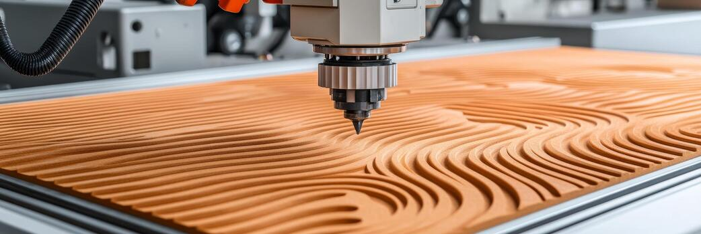
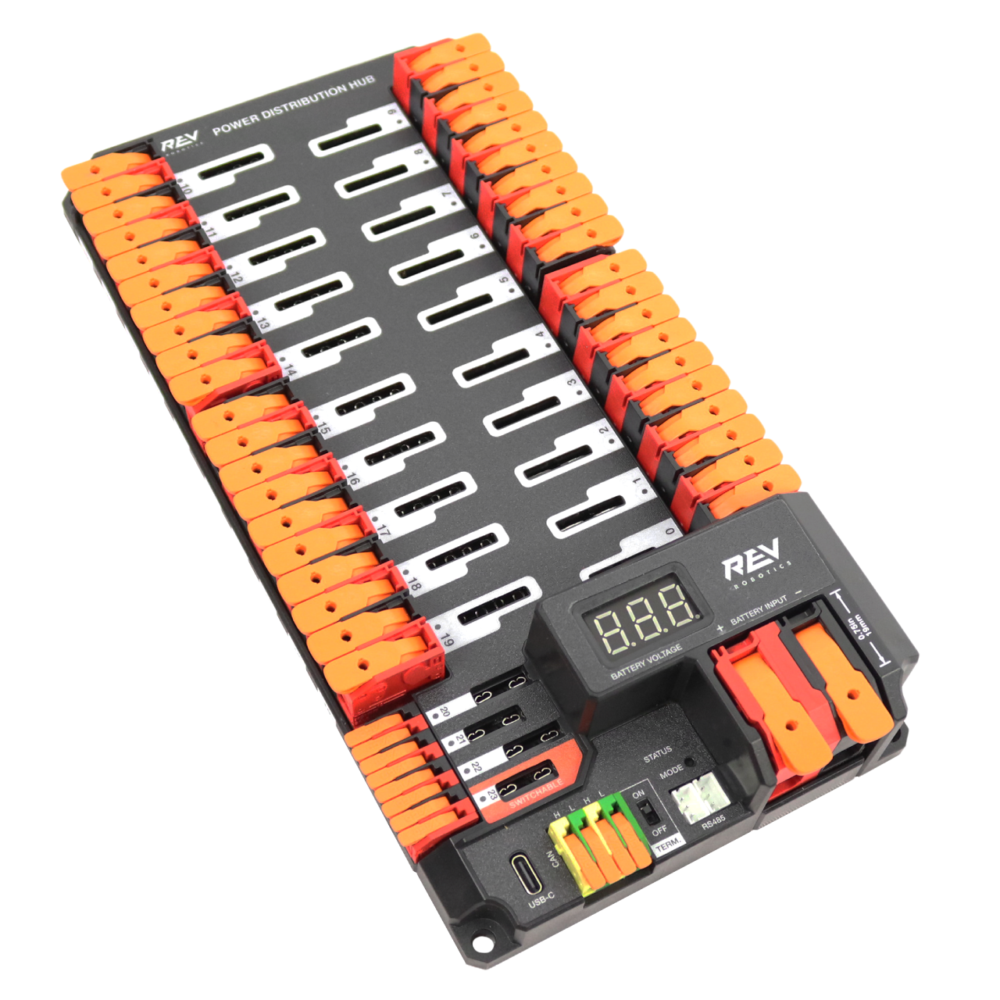

# Dictionary
---

### C

#### CNC { #cnc }
:   **Computer Numerical Control** is a type of automated equipment used in manufacturing that’s controlled by pre-programmed software. These machines can perform precise cutting, drilling, milling and other tasks with minimal human intervention.

References:

- [12 Types of CNC Machines & Their Functions](https://www.uti.edu/blog/cnc/6-cnc-machines)

### P

#### PDH {PDH}
:   **Power Distribution Hub** is the REV distribution solution to distribute battery power to all other components on a robot.

References:

- [Power Distribution Hub Overview](https://docs.revrobotics.com/ion-control/pdh/overview)